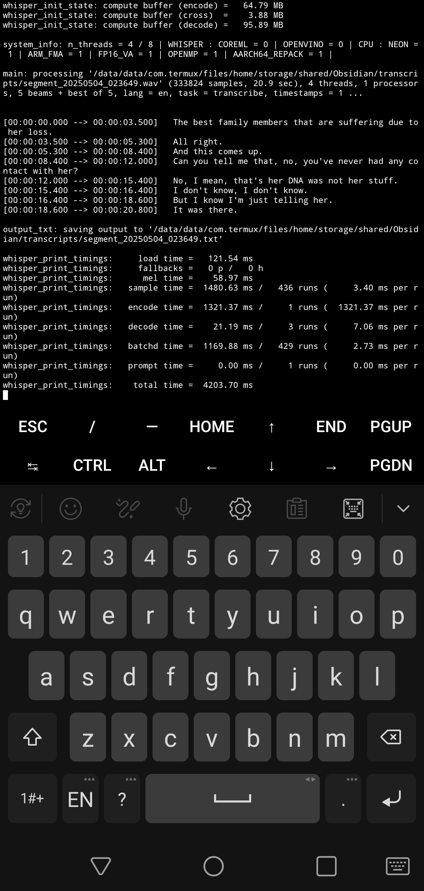

# Audiophile



## A Continuous Audio Transcription Pipeline


## 1. Summary

This project enables continuous 30-second audio recordings on Android devices using Termux, automatically transcribing them with OpenAI’s Whisper model via whisper.cpp. Transcriptions are appended to a daily markdown file, facilitating seamless integration with Obsidian for note-taking and knowledge management.


## 2. How It Works

- **Recording**: Utilizes `termux-microphone-record` to capture 30-second audio segments.
- **Transcription**: Converts `.m4a` files to `.wav` using `ffmpeg`, then transcribes using `whisper.cpp`.
- **Storage**: Appends transcriptions to a daily markdown file (`YYYY-MM-DD.md`) in the `transcripts` directory.
- **Automation**: A Bash script orchestrates the recording and transcription loop, handling file management and cleanup.

Audiophile is written in such a way that after 30s of audio is recorded, the  transcription is run in a separate thread as the next 30s of audio is recorded. Once the transcription process is complete, the transcribed audio file is removed. The result is real time transcription with minimal disk space investment. 

Advanced uses include chaining this with Tasker and Syncthing - allowing multitudes of use cases such as  real time audio to text to be recorded while your android device screen is off, synced into Obsidian across all your devices in real time!


## 3. Prerequisites

### Termux Setup

1. **Install Termux**: Download from [F-Droid](https://f-droid.org/en/packages/com.termux/).
2. **Update Packages**:
   ```bash
   pkg update && pkg upgrade
   ```
3. **Install Dependencies**:
   ```bash
   pkg install termux-api ffmpeg git cmake clang wget
   ```
4. **Grant Microphone Permission**:
   ```bash
   termux-microphone-record -d -f /dev/null
   ```
   Accept the permission prompt when it appears.

### Whisper.cpp Installation

1. **Clone Repository**:
   ```bash
   git clone https://github.com/ggerganov/whisper.cpp.git
   cd whisper.cpp
   ```
   
2. **Build**:
   ```bash
   cmake -B build
   cmake --build build --config Release
   ```
   
3. **Build Model**:
   ```bash
   make -j tiny.en.bin   # Fastest / least accurate
   make -j medium.en.bin # Slower / more accurate ...

## 4. Usage

### Running the Script

I. ```bash
   termux-setup-storage # Link termux and android storages
   ```
1. **Create Working Directory**:
   ```bash
   mkdir -p ~/storage/shared/Obsidian/transcripts
   ```
2. **Copy Script**: Save the provided Bash script as `record.sh` in your Termux home directory.
3. **Make Executable**:
   ```bash
   chmod +x record.sh
   ```
4. **Run**:
   ```bash
   ./record.sh
   ```
   Press `Ctrl+C` to stop the recording loop.

### Changing Models

To use a different Whisper model:

1. **Download Desired Model**:
   ```bash
   wget -c https://huggingface.co/ggerganov/whisper.cpp/resolve/main/ggml-base.en.bin -P models/
   ```
2. **Update Script**: Modify the `MODEL` variable in `record.sh`:
   ```bash
   MODEL="$HOME/whisper.cpp/models/ggml-base.en.bin"
   ```

## 5. Advanced

### 5a. Termux-API + Termux-Tasker + Tasker Integration

Enhance automation by integrating with Tasker:

1. **Install Termux:Tasker**: Available on [F-Droid](https://f-droid.org/en/packages/com.termux.tasker/).
2. **Create Tasker Profile**:
   - **Trigger**: Define your desired trigger (e.g., specific time, event).
   - **Action**: Add a Termux action to execute `record.sh`.
3. **Configure Termux:Tasker**:
   - Place `record.sh` in `~/.termux/tasker/`.
   - Ensure the script is executable:
     ```bash
     chmod +x ~/.termux/tasker/record.sh
     ```

This setup allows automated recording sessions based on defined triggers.

### 5b. Obsidian Integration

To integrate transcriptions with Obsidian:

1. **Set Vault Location**: Point your Obsidian vault to `~/storage/shared/Obsidian/`.
2. **Access Transcripts**: Transcriptions are saved in the `transcripts` folder as daily markdown files (`YYYY-MM-DD.md`).
3. **Organize Notes**: Utilize Obsidian's features to link, tag, and organize your transcriptions within your knowledge base.

### 5c. Syncthing for Cross-Device Sync

Synchronize your Obsidian vault across devices:

1. **Install Syncthing**:
   - **Android**: Available on [F-Droid](https://f-droid.org/en/packages/com.nutomic.syncthingandroid/).
   - **Desktop**: Download from [Syncthing.net](https://syncthing.net/).
2. **Configure Syncthing**:
   - **Add Folder**: Set the Obsidian vault (`~/storage/shared/Obsidian/`) as a shared folder.
   - **Connect Devices**: Use Syncthing's device ID system to link your Android device with your desktop.
3. **Sync**: Syncthing will automatically synchronize changes across connected devices, ensuring your transcriptions are available everywhere.

**Note**: Ensure Syncthing is running on all devices for seamless synchronization.

## 6. Troubleshooting

- **Empty Transcriptions**: Verify that the audio files are correctly recorded and that the Whisper model is properly downloaded.
- **Permission Issues**: Ensure Termux has the necessary permissions to access the microphone and storage.
- **Script Errors**: Run the script manually to identify and resolve any errors.

## 7. License

This project is licensed under the MIT License.


